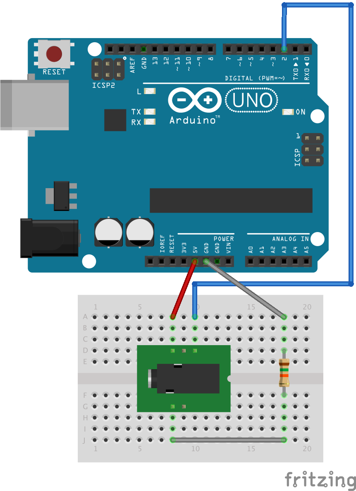
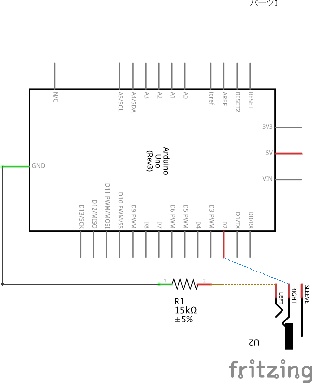

#AeroCraft

##What's this?
エアロバイクでマインクラフトの世界を走りたい!という夢(?)を簡単に実現することを目標としているソフトウェアです。

##動作環境
確認出来ているのは、Mac OS X10.11.2のみです。
~~おそらく他のOSでも動くとは思いますが、動作が違う可能性もありますのでご注意ください。~~

※追記
Windows Server 2012 R2（Windows8.1相当）で、動作が確認できませんでした。
とりあえずは、Macのみの対応とさせていただきます。

なお、Macでは、Google日本語入力で本来の動作を確認しています。Mac標準の日本語入力ソフトウェアでは、ジャンプ等が出来ないことがあります。

##準備
- Arduino Uno
- 15kΩ抵抗
- 3.5mmミニジャック(モノラルでも可)
 - http://akizukidenshi.com/catalog/c/c35jack/
 - 自分は百均の分配器から取り出しました
- エアロバイク(重要)
 - http://www.amazon.co.jp/dp/B00F9LU1DQ/
 - 私はコレを使ってます
 - その他仕様が同様のものであれば可能だと思います

##配線
###ブレッドボード

###回路図

##エアロバイクの仕様
累計時間やカロリー等を、表示するメーターに繋がっているケーブルがイヤホンジャック(モノラル)で、ペダルが一定の場所にある場合のみ通電するという仕組みでした。

AFB4413の場合は、右足ペダルが下に行った時でした。

##手順
###初回のみ
####Arduinoボードへの書き込み
当ソフトウェアのArduinoフォルダへ移動し、その中にあるファイルを開きます。
この際開けない場合は、http://arduino.cc/ より開発ソフトウェアをダウンロードしてインストールしてください。

次に、Arduinoを接続して書き込みます。
上のほうにある右矢印ボタンで書き込めます。

####ソフトウェアのダウンロード
リリースページhttps://github.com/KawakawaRitsuki/Aerocraft/releases からjarファイルをダウンロードして下さい。

####マインクラフトの設定
キーコンフィグから、スニークをK、ダッシュをLに割り当てておいてください。

####コンピュータの設定
もし、Google日本語入力が入ってない場合は、インストールしておいてください。

###毎回の手順
jarファイルをダブルクリックして、起動してください。
上のメニューで、Arduinoのポートを選択します。

ポートはパソコンによって違います。Arduino開発ソフトウェアの右下に書いてあります。
どうしてもわからない場合はすべて試してみてください。

そして、選択したら下の開始ボタンを押します。この際に、通電していると不具合が起きることがあるので、AFB4413の場合は右足ペダルが下に無いようにしましょう。

開始ボタンを押したら、マインクラフトの画面にします。
そして、ワールドを開いたら、数周漕いでみましょう。
前に進むことができたら成功です。

##よくある質問
####Q.前に進めない
A.きちんと接続していますか?また、ソフトウェアは起動していますか?ソフトウェアのポートの設定は間違っていませんか?
####Q.強制終了する
A.エラーの状況をissuesに書いてもらえると嬉しいです。

